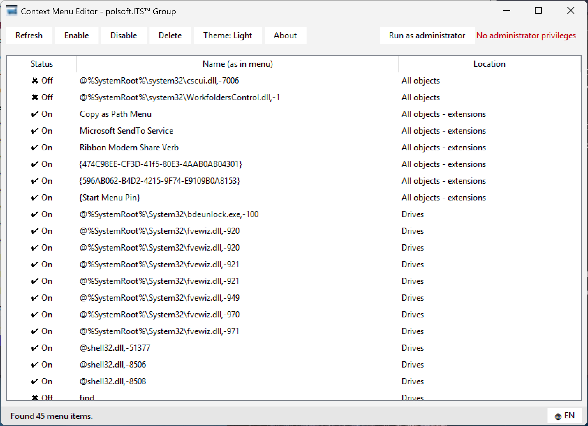

<p align="center">
  
</p>

<h1 align="center">Context Menu Editor</h1>

<p align="center">
  A lightweight, portable Windows 11 tool to manage right-click context menu entries.
</p>

<p align="center">
  
  
  
  
</p>

---

## Table of Contents

- [Overview](#overview)
- [Features](#features)
- [Screenshots](#screenshots)
- [Download](#download)
- [Usage](#usage)
- [How it works](#how-it-works)
- [Building from source](#building-from-source)
- [Requirements](#requirements)
- [FAQ](#faq)
- [Troubleshooting](#troubleshooting)
- [Roadmap](#roadmap)
- [Contributing](#contributing)
- [License](#license)

---

## Overview

**Context Menu Editor** shows exactly the entries that appear when you right-click in Windows 11 — the same items visible under *"Show more options"* — with no extra clutter, no confusing registry paths, and no guesswork.

Windows accumulates context menu entries from installed software over time, and there's no built-in way to review or clean them up. This tool gives you a clear, readable list of every entry per location (files, folders, folder background, drives, all objects) and lets you **enable**, **disable**, or **permanently delete** any of them from a single window — safely, and with a one-click undo path (disable instead of delete) for anything you're not sure about.

## Features

- 🖱️ **Real context menu entries** — files, folders, folder background (empty space), drives, and all objects, including their extension-based variants
- 📜 **Fully scrollable list** — visible vertical & horizontal scrollbars, mouse-wheel support (Shift + wheel for horizontal), and keyboard navigation (Home / End / Page Up / Page Down)
- 🖱️ **Right-click context menu** on the list itself — Refresh, Enable, Disable, Copy name, Delete, right where you're looking
- ✅ **Enable / disable** entries without deleting them — fully reversible
- 🗑️ **Permanent deletion** of unwanted entries, with a confirmation prompt to prevent mistakes
- 🌗 **Light and dark theme**, matching the native Windows 11 look
- 🌍 **English / Polish interface**, switchable at runtime with one click
- 🔐 **Optional administrator mode** ("Run as administrator") for full `HKLM` / `HKCR` access to system-wide entries
- ⚙️ **MUI string resolution** — resource-based menu labels (e.g. `@shell32.dll,-1234`) are automatically translated to readable text
- 💾 **Persistent preferences** — theme and language are remembered between sessions
- 📦 **Truly portable** — a single `.exe` file, no installer, no dependencies, icon fully embedded at compile time; nothing is extracted or left behind next to the executable

## Screenshots

<p align="center">
  
  <br>
  <em>Main window — status, name, and location of every detected context menu entry.</em>
</p>

## Download

Grab the latest portable build from the [Releases](../../releases) page:

```
ContextMenuEditor.exe
```

No installation, no dependencies, no admin rights required just to launch it (administrator mode can be enabled from within the app whenever it's needed).

## Usage

1. Download `ContextMenuEditor.exe`.
2. Run it — double-click, no setup needed.
3. Click **Refresh** to scan the current context menu entries.
4. Select one or more entries in the list.
5. Use **Enable**, **Disable**, or **Delete** as needed — or **right-click** any row for a quick context menu with the same actions plus **Copy name**.
6. For system-wide (`HKLM`) entries that require elevated rights, click **Run as administrator** — the app will relaunch itself with elevation.
7. Switch **Theme** (light/dark) or **language** (EN/PL) at any time from the bottom bar.

> Settings (theme, language) are stored locally in `%userprofile%\.polsoft\settings\WebViewer.json`.

## How it works

Context Menu Editor reads the same registry locations Windows itself uses to build the right-click menu (`HKEY_CLASSES_ROOT` and related `HKEY_CURRENT_USER` / `HKEY_LOCAL_MACHINE` keys for files, folders, drives, and background entries). Disabling an entry sets the standard `LegacyDisable` marker Windows recognizes, rather than corrupting or removing the underlying data — so disabled entries can always be turned back on. Deleting an entry removes the corresponding registry key outright, which is why a confirmation step is always shown first.

## Building from source

This repository includes everything needed to build the portable `.exe` yourself with [PyInstaller](https://pyinstaller.org/):

| File | Purpose |
|---|---|
| `context_menu_editor.py` | Application source |
| `ico.ico` | Application icon |
| `ContextMenuEditor.spec` | PyInstaller build spec (one-file, windowed, icon, version info) |
| `version_info.txt` | Windows version resource (file properties) |
| `extract_icon_hook.py` | Runtime hook keeping the embedded icon working in one-file mode |
| `build.bat` | One-click build script |

```bat
build.bat
```

The compiled executable is created at `dist\ContextMenuEditor.exe`.

**Requirements:** Windows, Python 3, `pip install pyinstaller` (installed automatically by `build.bat` if missing).

## Requirements

- Windows 11 (or Windows 10)
- Administrator privileges recommended for editing system-wide (`HKLM`) entries
- No Python installation needed to *run* the compiled `.exe` — only to *build* it from source

## FAQ

**Does this modify system files?**
No. It only reads and writes standard Windows Registry keys used for context menu configuration — the same ones Windows itself reads.

**Is disabling reversible?**
Yes, always. Disabling an entry simply flags it as hidden; re-enable it anytime.

**Is deleting reversible?**
No. Deletion removes the registry key permanently, which is why a confirmation dialog is always shown.

**Why do some entries need administrator rights?**
Entries defined under `HKEY_LOCAL_MACHINE` are shared system-wide and Windows requires elevated privileges to modify them.

## Troubleshooting

| Problem | Solution |
|---|---|
| "Failed to change" / "Failed to delete" message | Click **Run as administrator**, then retry |
| Entry reappears after deletion | It was reinstalled by its parent application; disable it instead of deleting |
| Icon not visible in taskbar | Make sure you're running the officially built `ContextMenuEditor.exe`, not a renamed/copied file |

## Roadmap

- [ ] Search / filter box for large entry lists
- [ ] Export / import of enabled-disabled state
- [ ] Additional language packs

## Contributing

Issues and pull requests are welcome. Please open an issue first to discuss significant changes.

## License

**Freeware** — free to download and use for personal and commercial purposes, provided the application is redistributed unmodified and without charge. See the repository for full terms.

---

<p align="center">Made for a cleaner right-click menu.</p>

<p align="center">
  <sub>
    Context Menu Editor v1.1.5 &nbsp;•&nbsp; Author: Sebastian Januchowski &nbsp;•&nbsp; polsoft.ITS™ Group<br>
    Contact: polsoft.its@mail.com &nbsp;•&nbsp; GitHub: github.com/polsoft-seb07uk
  </sub>
</p>
